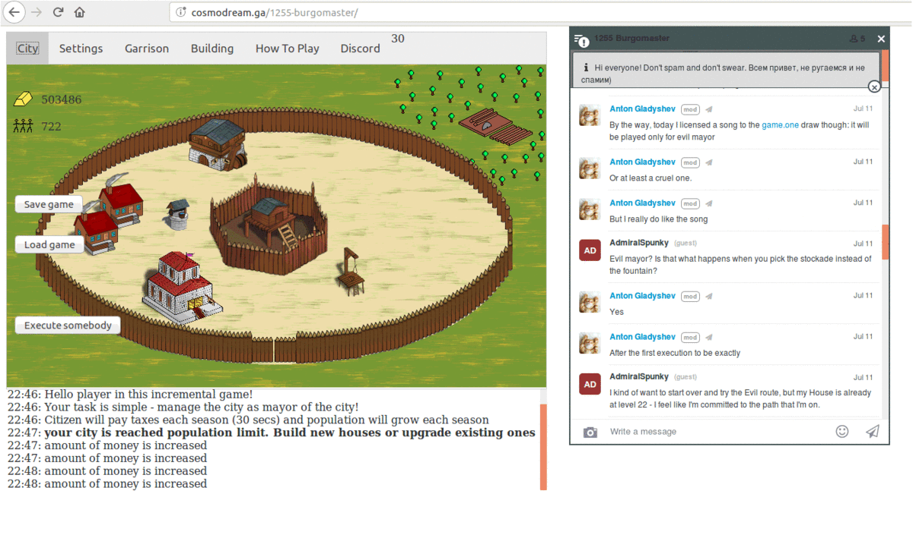

<html>
	<body>
		<h1>1255 Burgomaster</h1> 
		
		<h2>Play the game</h2> 
		<a href="https://areso.github.io/1255-burgomaster">Play the game in web</a> 
		<a href="http://cosmodream.ga/1255-burgomaster">Play the game in web (reserve link)</a>  
		<h2>About the project</h2> 
		Hello there! My name is Gladyshev Anton, and I'm the author of the project. 
		The homepage of the project is <a href="https://github.com/Areso/1255-burgomaster">https://github.com/Areso/1255-burgomaster</a>. 
		This pet-project is dedicated to create a playable game, written in vanilla JavaScript, without using even jQuery and modern whistlers and jugglers, such as JS frameworks, TS->JS compilators, Node.js, web servers and so on. 
		Thus, to play the game, you need only a modern browser. To edit the game, you need only a text editor and imagination.
		The project oriented to be compact (in terms of the source code and the resources), blazing fast to download, fast enough to run even on aging devices with limited horsepower under the hood. 
		It runs well even on low-powered tablets and phones, let alone old PCs and laptops. 
		It heavily uses JS technologies as HTML5.Canvas, EcmaScript5 localStorage, JSON.parse(), and so on. So it requires a somewhat modern browser, with ES5/ES6 standarts support. 
		 				
		<h2>Minimum System Requirements</h2>
		Browsers:  
		Internet Explorer 10, Internet Explorer Mobile 10 - some functions may not work 
		Mozilla Firefox 20 or newer, Firefox Android All 
		Google Chrome 20 or newer, Chrome Android All 
		Safari 5, iOS Safari 5 
		Opera 12, Opera Mobile 12 - some functions may not work  
		Blackberry Browser 7 - some functions may not work 
		*Please note, Opera Mini is NOT SUPPORTED! 
		Data about Browser support provided by <a href="https://caniuse.com/">https://caniuse.com/</a> service 
		 
		512MB RAM 
		600MHz 1 Core CPU 
		1MB of data plan to download the game itself, analytics, and chat. 
		And some traffic will be used with in-game chat and usage statistics, though the game will work perfectly even if a connection is lost after the download is complete. 
		You also may download the game, to run it in offline (check options offline game).  
		 
		<h2>About the game</h2>
		 
		
		 
		Supported Languages(SL): English, Russian (Русский). 
		Community Supported Languages(CSL): German (Deutsch), Esperanto, French (Français) 
		Make note that my opportunity to translate the game to CSL is limited. I can answer in chat in supported languages and in Esperanto. 
		Also, any CSL translation could have mistakes or untranslated parts or parts of translation which are partly outdated. 
		You could help with translations for the game here:  
		<a href='https://docs.google.com/spreadsheets/d/1WxRoxfPpYBHqvWb4mQNxGVr3r4VyxHSEuELzdU1I2PE'>https://docs.google.com/spreadsheets/d/1WxRoxfPpYBHqvWb4mQNxGVr3r4VyxHSEuELzdU1I2PE</a> 
		This is a single-player game. There is built-in chat but it is not currently available to chat in.  
		Also, the game now has global goals, which are usually activated for a limited time. 
		In those events, all players work together to achieve a high global goal, and in case of the achievement, they all got a reward, according to their pledge in the achievement.  
		The game itself is about building a city. You with with a set amount of gold and a few citizens. 
		This is an IDLE game, which means, every minute your citizens will spawn new citizens and pay taxes to you. 
		You can construct buildings as well as upgrade buildings, but upgrading existing ones will require each time more gold. 
		As for now, constructing building does not require time, only resources.  
		Straight management, which means, you need place management by clicking here and there and you will get what you clicked. 
		What game offers now: 
		<ul>
		<li>12 buildings to build of 9 types</li>
		<li>maps to explore (HoMM3-like)</li>
		<li>autocampaigns (Fallout Shelter-like)</li>
		<li>a hero managemenet</li>
		<li>troops managemenet</li>
		<li>artifacts to collect</li>
		<li>executing people</li>
		<li>placing festivals</li>
		<li>random events: stealings from the treasury, fires and plagues</li>
		<li>time-limited events: Halloween</li>
		<li>two decoration themes: Summer and Winter</li>
		<li>a record table</li>
		</ul>
		
You will explore wild territories near your city.
 
		Regarding your choices, you could get a boost in taxes, birthrate, happiness and so on. 
		The game could become a Clicker game if you build the Gallows, and like to execute you citizens. 
		This game created and new features right now in development inspired by Travian, Townsmen, Stronghold and Stronghold Crusaders, HoMM (Heroes of Might and Magic), Lord of Realm, Anno series.  
		You can export and import save to transfer your progress between different browsers and PCs.  
		<h2>License</h2> 
		The source code is under GPLv3. 
		ALL GRAPHIC AND SOUND ASSETS UNDER PROPRIETARY LICENSE. 
		YOU MAY NOT REDISTRIBUTE THE GAME WITH THE ASSETS VIA PUBLISHING IN INTERNET, STORES, OR ANY OTHER WAY 
		YOU MAY USE ASSETS ONLY FOR LOCAL RUNNING 
</body>
<html>
